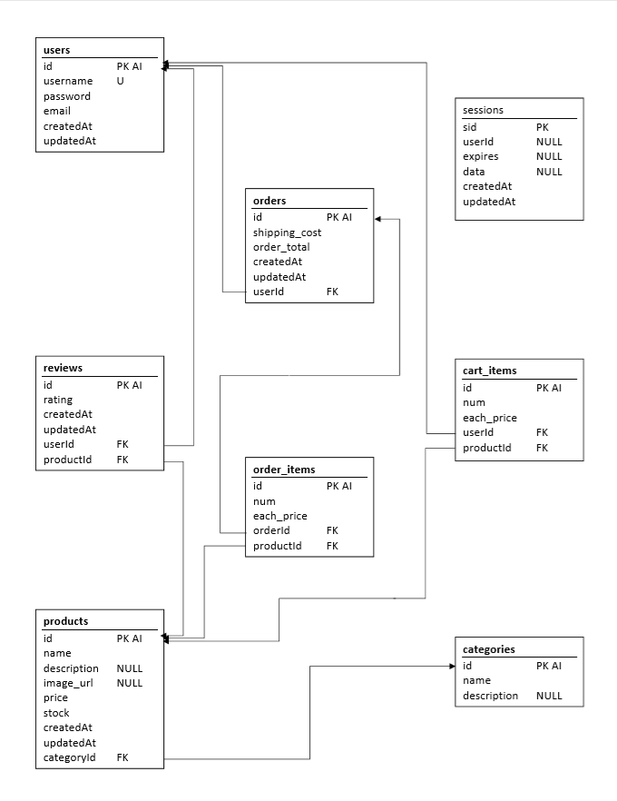

# eMarketplace
[](https://standardjs.com)


An online marketplace simulating a digital store inventory with a user account system that allows users to place an order for items/services and checkout.
This store allows a user to:
* Create an account
* Log in & Edit an account
* Add items to a cart
* Update and remove Items from the cart
* Submit an order. 
* View placed order.
* View all orders placed from that account.

---

## Getting Started

To use this project, you'll need to do the following:

* Clone this repository onto your computer or upload it to heroku.

* If you're running it locally on your pc, also perform these steps:

    * run `npm i` from the terminal (this will install the npm modules: dotenv, bcrypt, connect-session-sequelize, express, express-handlebars, express-session, mysql2, passport, sequelize and validator)
    * create the mysql database using the `schema.sql` file
    * create a `.env` file with your MySQL Database password in the following format 
     (this was included in the `.gitignore` file to prevent the password from being exposed on Github):
    ```
    DB_PASSWORD="your_database_password_here"
    ```

This file will be imported by `config/index.js` while running on your computer locally because of the following changes to the `config/index.js` file.

    ```js
    let sequelize;
    if (config.use_env_variable) {
        sequelize = new Sequelize(process.env[config.use_env_variable], config);
    } else {
        // assign the local password from the `.env` to a new password variable. 
        const password = process.env.DB_PASSWORD;
        sequelize = new Sequelize(config.database, config.username,/*config.password is now*/ password, config);
    }
    ```

* run 'server.js' to dynamically create the required tables
* seed the newly created database tables with the `seeds.sql` file


---

## Our MySQL database layout for this project:



---

## NPM Packages used in this project
*Dependencies:*
* [bcrypt](https://www.npmjs.com/package/bcrypt)
* [connect-session-sequelize](https://www.npmjs.com/package/connect-session-sequelize)
* [dotenv](https://www.npmjs.com/package/dotenv)
* [express](https://www.npmjs.com/package/express)
* [express-handlebars](https://www.npmjs.com/package/express-handlebars)
* [express-session](https://www.npmjs.com/package/express-session)
* [mysql2](https://www.npmjs.com/package/mysql2)
* [passport](https://www.npmjs.com/package/passport)
* [sequelize](https://www.npmjs.com/package/sequelize)

*Devevelopment Dependencies:*
* [Nodemon](https://www.npmjs.com/package/nodemon)
* [Standard](https://www.npmjs.com/package/standard)

---

## eMarketplace was created by:

* Mike Gullo
    * Portfolio: [https://mike14747.github.io/](https://mike14747.github.io/)
* Michelle William
    * Github: [https://github.com/letscook1](https://github.com/letscook1)
* Vincent Shury
    * LinkedIn: [https://www.linkedin.com/in/vincent-shury/](https://www.linkedin.com/in/vincent-shury/)
    * Github Portfolio: [https://vincent440.github.io/](https://vincent440.github.io/)
    * Github Profile: [https://github.com/Vincent440](https://github.com/Vincent440) 
* Link to the website is in the Github repository description [Here](#repo-meta-edit)

* Contact us at: letscook1@hotmail.com | vinceshury@gmail.com | mike14747@oh.rr.com for more info about this project.